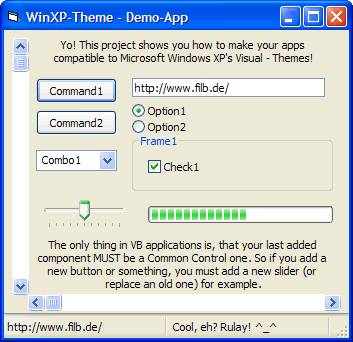



## Use Windows XP's Visual\-Themes\!

### Description

So... You want to add Windows XP's Visual Theme support to your own applications?

No problem with this code (you can test this only if you have got Windows XP on your computer!).

The secret is the existing YourApp.exe.manifest file in the same folder! Try it out. Download my code, check the .manifest file and add this to your own application. ^_^... Another possibility is that you add a resource file to your application with help of a Resource Hack - program. Maybe it's possible with inserted .RES files too, I'm not sure.

Ah, before I forget: You can use .manifest files for EVERY application that uses the Microsoft Common Controls (comctl32.ocx), so you can use this code with VB3, VB4, VB5, VB.NET, VC++, Delphi, etc. too. Just try it out. Have much fun with this code. ^_^
 
### More Info
 

             |
---                |---
**Submitted On**   |2001-10-08 18:05:48
**By**             |[Filb](https://github.com/Planet-Source-Code/PSCIndex/blob/master/ByAuthor/filb.md)
**Level**          |Beginner
**User Rating**    |4.3 (26 globes from 6 users)
**Compatibility**  |VB 6\.0
**Category**       |[Windows System Services](https://github.com/Planet-Source-Code/PSCIndex/blob/master/ByCategory/windows-system-services__1-35.md)
**World**          |[Visual Basic](https://github.com/Planet-Source-Code/PSCIndex/blob/master/ByWorld/visual-basic.md)
**Archive File**   |[Use Window279091082001\.zip](https://github.com/Planet-Source-Code/filb-use-windows-xp-s-visual-themes__1-27909/archive/master.zip)

